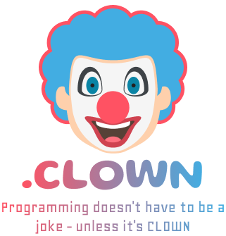

<div style="text-align:center;">
    
</div>

# CLOWN

### Programming doesn't have to be a joke - unless it's CLOWN

# Run The code (Ubuntu)

- remove extern int yydebug; to simple.y if any
- remove yydebug = 1; to main function in simple.y if any

```
flex -l -d simple.lex
bison -l -d -v simple.y
gcc -o parser simple.tab.c simple.tab.h lex.yy.c -lfl
./parser < code.clown
```

# Run The code with debug (Ubuntu)

- add extern int yydebug; to simple.y
- add yydebug = 1; to main function in simple.y

```
flex -l -d simple.lex
bison -l -d -v simple.y
gcc -o parser -DYYDEBUG simple.tab.c simple.tab.h lex.yy.c -lfl
```

## Keywords

```
"print", "if", "else", "elif", "while", "for", "do", "break", "continue", "return", "=", "==", "!=", ">", ">=", "<", "<=", "+", "-", "*", "/", "^", "%", "||", "&&", "!", "(", ")", "{", "}", ";", "function", "const", "switch", "case", "default", "enum", "NULL", ":", ","
```

## Syntax

### print

```
print ("Hello World");
print(a);
print(a+b);
print(1+2+3);
```

### if elif else

```
if (a == 1) {
    print("a is 1");
} elif (a == 2) {
    print("a is 2");
} else {
    print("a is not 1 or 2");
}
```

### while

```
while (a < 10) {
    print(a);
    a = a + 1;
}
```

### for loop

```
for (i = 0; i < 10; i = i + 1) {
    print(i);
}

```

### do while

```
do {
    print(a);
    a = a + 1;
} while (a < 10);
```

### break

```
while (a < 10) {
    print(a);
    a = a + 1;
    if (a == 5) {
        break;
    }
}
```

### continue

```
while (a < 10) {
    a = a + 1;
    if (a == 5) {
        continue;
    }
    print(a);
}
```

### return

```
function add(a, b) {
    return a + b;
}
```

### function call

```
z = add(1, 2);
add(1, 2);
```

### const

```
const a = 1;
```

### switch case

```
switch (a) {
    case 1:
        print("a is 1");
        break;
    case 2:
        print("a is 2");
        break;
    default:
        print("a is not 1 or 2");
        break;
}
```

### enum

```
enum Color {
    RED,
    GREEN,
    BLUE = 5
};
```

### enum usage

```
Color color = RED;
```

### NULL

```
a = NULL;
return NULL;
```

### comments

```
/* This is a comment */
```

### Mathematical operations

```
a = 1 + 2;
b = 1 - 2;
c = 1 * 2;
d = 1 / 2;
e = 1 ^ 2;
f = 1 % 2;
z = (a + b) * ((c - d))^e;
```

### Logical operations

```
a = 5 > 2;
b = 5 >= 2;
c = 5 < 2;
d = 5 <= 2;
e = 5 == 2;
f = 5 != 2;
g = a && b;
h = a || b;
i = !a;
```

## Language Grammar

```
program : statement_list
        ;

statement_list : statement
               | statement_list statement
               ;

statement : assignment_statement
          | print_statement
          | if_statement
          | while_statement
          | for_statement
          | do_statement
          | break_statement
          | continue_statement
          | return_statement
          | error_statement
          | function_declaration
          | function_call
          | const_declaration
          | switch_statement
         ;

assignment_statement : IDENTIFIER ASSIGN expression SEMICOLON
                    | IDENTIFIER ASSIGN function_call
                      ;

function_declaration : FUNCTION IDENTIFIER LPAREN function_parameters RPAREN LBRACE statement_list RBRACE
                   ;

function_parameters : function_parameters COMMA IDENTIFIER
                    | IDENTIFIER
                    ;

function_call : IDENTIFIER LPAREN function_arguments RPAREN SEMICOLON
                ;

function_arguments : function_arguments COMMA expression
                   | expression
                   ;


const_declaration: CONST assignment_statement
                 ;

switch_statement: SWITCH LPAREN IDENTIFIER RPAREN LBRACE switch_statement_details RBRACE
                ;

switch_statement_details: switch_statement_details switch_case
                        | switch_case
                        ;

switch_case: CASE expression COLON statement_list
              | DEFAULT COLON statement_list
              ;

print_statement : PRINT expression SEMICOLON
                ;

if_statement : IF LPAREN expression RPAREN LBRACE statement_list RBRACE %prec ELSE
             | IF LPAREN expression RPAREN LBRACE statement_list RBRACE ELSE LBRACE statement_list RBRACE
             ;

while_statement : WHILE LPAREN expression RPAREN LBRACE statement_list RBRACE
                 ;

for_statement : FOR LPAREN for_init  expression SEMICOLON for_update RPAREN LBRACE statement_list RBRACE
              ;

for_init : assignment_statement
         | SEMICOLON
         ;

for_update : assignment_statement
           | SEMICOLON
           ;

do_statement : DO LBRACE statement_list RBRACE WHILE LPAREN expression RPAREN SEMICOLON
             ;

break_statement : BREAK SEMICOLON
                ;

continue_statement : CONTINUE SEMICOLON
                   ;

return_statement : RETURN expression SEMICOLON
                 ;

error_statement : ERROR SEMICOLON
                ;

expression : INTEGER
           | STRING
           | IDENTIFIER
           | LPAREN expression RPAREN             %prec UMINUS
           | expression PLUS expression           %prec PLUS
           | expression MINUS expression          %prec MINUS
           | expression TIMES expression          %prec TIMES
           | expression DIVIDE expression         %prec DIVIDE
           | expression EQUAL expression          %prec EQUAL
           | expression NOTEQUAL expression       %prec EQUAL
           | expression GREATER expression        %prec GREATER
           | expression GREATEREQUAL expression   %prec GREATER
           | expression LESS expression           %prec LESS
           | expression LESSEQUAL expression      %prec LESS
           | NOT expression                       %prec NOT
           | expression OR expression             %prec OR
           | expression AND expression            %prec AND
           | MINUS expression                     %prec UMINUS
           ;
```
